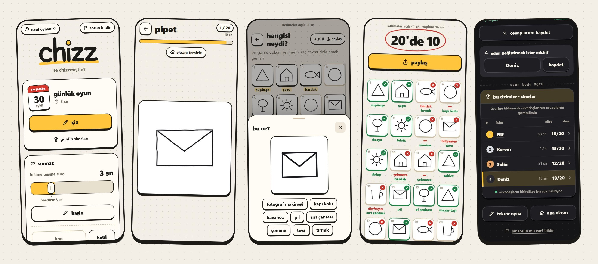

<p align="center">
  
</p>

<h1 align="center">chizz</h1>

<p align="center">
  A drawing and memory game, in Turkish and English.<br>
  <b>Play at <a href="https://chizz.party">chizz.party</a></b>
</p>

---

Twenty words arrive one at a time, three seconds each, and you scribble something for
every one. Then your drawings come back shuffled and you have to say which was which.

The catch: the words in a round are picked to share a silhouette — `fil` and `koltuk`
are the same rough shape — so your own drawings turn against you.

## The two games

**günlük** — the same twenty words for everyone, once a day, with a board to land on.

**sınırsız** — as many rounds as you like, dealt to your device so words do not repeat.

Either one can be sent to a friend as a link. They guess your drawings and appear on a
live score board for that round. When it is over, `görsel olarak indir` saves the whole
round — every drawing, every answer, every right word — as one picture to keep or send.

## Playing

1. Press **çiz** for the day, or **başla** for an unlimited round
2. Draw all twenty — the clock moves on by itself, there is no going back
3. Guess your own drawings, or send them to someone
4. Choose **kolay** (match the words to the drawings) or **zor** (type them yourself),
   then finish

Nothing is asked before you start. A name is wanted only to share a round or join a
board, so it is asked then and never again. Typed answers forgive one typo: `koltok`
still counts for `koltuk`.

No account, no login, no cookie banner, nothing loaded from anywhere else. How the game is
played — screens, taps, drawings, answers — is recorded anonymously on chizz's own server,
for fixing it and for [analysis](analysis/README.md); see [privacy](public/privacy.html).

## The words

702 words in 15 **silhouette families** — the shape a thing draws as, not what it is, so
a lion and a sofa can share a round. A word does not come back for 14 days. The same
words are also sorted by subject, 20 of them, in
[docs/CATEGORIES.md](docs/CATEGORIES.md).

## Running it

Solo play needs nothing: open `public/index.html` in a browser. Links and score boards
need the API:

```bash
npx wrangler pages dev
```

Then `http://localhost:8788` — or double-click `start.cmd` on Windows. If the project
path is long, workerd fails with `SQLITE_CANTOPEN`; pass `--persist-to C:/wr`.

Deploying needs a Cloudflare account and a KV namespace bound as `GAMES`:
[docs/DEPLOY.md](docs/DEPLOY.md).

## How it is built

- **One file.** `public/index.html` is the whole game — HTML, CSS and plain JavaScript.
  No framework, no build step, no dependencies, nothing from a CDN. The wordmark, the
  icons, the illustrations and the how-to loop are drawn in the page too, so it loads no
  font and no picture.
- **Drawings are strokes, not images**: coordinate arrays normalised to 0–1, quantised
  to bytes for transport, so they redraw cleanly at any size — a grid cell, a zoom, or
  a downloaded picture.
- [Cloudflare Pages](https://pages.cloudflare.com/) for hosting, Pages Functions for the
  API, Workers KV for storage. Rounds are kept, so a link keeps working.
- Paste a link into a chat and the preview shows the drawings: the PNG is encoded by
  hand from the stored strokes, with no image library.
- The server keeps the words, the drawings, the mode, the seconds and a name of up to
  ten characters. Your device keeps your name, your settings and rounds in progress, so
  a reload does not cost you a game.

## Docs

- [docs/SPEC.md](docs/SPEC.md) — what the game does today, written from the code
- [docs/DESIGN.md](docs/DESIGN.md) — how it looks and why: the sketchbook, its tokens and
  the reasoning behind each screen
- [docs/WORDS.md](docs/WORDS.md) and [docs/CATEGORIES.md](docs/CATEGORIES.md) — the pool
- [docs/DEPLOY.md](docs/DEPLOY.md) · [docs/CHANGELOG.md](docs/CHANGELOG.md)
